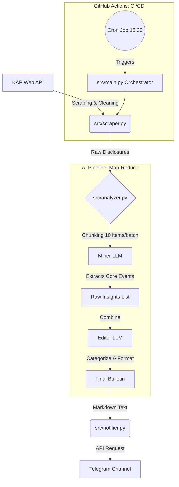

# 📈 KAP AI Analyst: Enterprise-Grade Financial Intelligence Bot

> **Automated, AI-driven financial insights delivered directly to your pocket.**

KAP AI Analyst is a production-ready, serverless automation tool designed to scrape, analyze, and summarize daily disclosures from Borsa Istanbul (KAP). Built with **Object-Oriented Programming (OOP)** principles and a **Map-Reduce LLM architecture**, it filters out market noise and delivers high-value, categorized financial summaries via Telegram.

---

## 🌟 Key Features

* **🧠 Advanced AI Engine (Map-Reduce):** Solves LLM token limits and context loss by using a two-stage analysis pipeline. Stage 1 (Miner) extracts raw data in chunks. Stage 2 (Editor) synthesizes it into a cohesive, categorized bulletin.
* **🏗️ Enterprise Architecture:** Fully modular design (`Scraper`, `Analyzer`, `Notifier`, `Orchestrator`) adhering to SOLID principles.
* **🛡️ Robust Error Handling & Logging:** Integrated Python `logging` with file and console handlers, ensuring traceability and easy debugging.
* **⚙️ 100% Serverless & Zero-Cost:** Fully automated via **GitHub Actions** Cron Jobs. No servers to maintain.
* **📦 Smart Scraping:** Handles complex nested HTML and dynamic JSON payloads to extract data that standard APIs miss.

---

## 🏗️ System Architecture

The project is structured into independent modules orchestrated by a central pipeline.

## 🚀 Setup & Installation

1. Clone the Repository
    git clone [https://github.com/YOUR_USERNAME/KapHaberi.git](https://github.com/YOUR_USERNAME/KapHaberi.git)
    cd KapHaberi

2. Install Dependencies
    pip install -r requirements.txt

3. Environment Variables
Create a .env file in the root directory and add your API keys:

GROQ_API_KEY=gsk_your_groq_api_key
TELEGRAM_TOKEN=your_telegram_bot_token
TELEGRAM_CHAT_ID=@your_channel_name   

4. Run Locally
    python src/main.py

## 📊 Example Output (Telegram)
The bot outputs a beautifully formatted, categorized daily summary:

📢 Borsa Gün Sonu Raporu | 28.01.2026

💼 YENİ İŞ & İHALELER

ASELS: Savunma Sanayii Başkanlığı ile 50 Milyon USD tutarında yeni bir elektronik harp sistemi sözleşmesi imzalandı.

KONTR: Enerji altyapı ihalesi kazanıldı, ciroya olumlu etkisi bekleniyor.

💰 SERMAYE & TEMETTÜ

THYAO: 2025 yılı kârından hisse başına 2.5 TL temettü dağıtma kararı alındı.

PASIFIK: Tahsisli sermaye artırımı SPK tarafından onaylandı.

(Rutin bildirimler ve devre kesiciler Yapay Zeka tarafından elenmiştir.)

##🛠️ Tech Stack & Tools
Language: Python 3.10+

LLM Framework: LangChain (langchain-core, langchain-groq)

Models: Meta Llama 3.3 70B Versatile (via Groq Cloud)

Data Extraction: BeautifulSoup4, Requests, Regex

Automation: GitHub Actions, Make.com (for On-Demand Webhooks)

Type Hinting: Strictly typed for enterprise readiness.

## 👨‍💻 About the Developer
I am a Freelance AI Engineer & Full-Stack Developer | Intelligent Apps • AI Agents • Data specializing in building scalable AI architectures, advanced agent systems, and automated data pipelines.

Let's connect: [LinkedIn Profile URL]

Hire me on Upwork: [Upwork Profile URL]

Portfolio: [Your Personal Website URL]

If you found this project interesting or helpful, please consider giving it a ⭐!   
